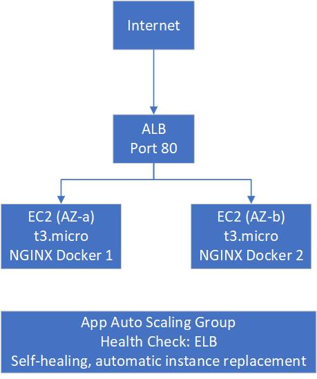

# Auto-Healing Web Tier

A self-healing, auto-scaling web infrastructure provisioned entirely with Terraform on AWS.

---

## Architecture





## Requirements

- [Terraform](https://developer.hashicorp.com/terraform/downloads) >= 1.9
- AWS account with credentials configured (`aws configure`)
- [Docker](https://docs.docker.com/get-docker/) (for building the container image)

## Quick Start

### 1. Build and push the Docker image

```bash
# Build
docker build -t ghcr.io/YOUR_GH_USERNAME/auto-healing-web-nginx:latest .

# Login to GHCR
echo $GHCR_TOKEN | docker login ghcr.io -u YOUR_GH_USERNAME --password-stdin

# Push
docker push ghcr.io/YOUR_GH_USERNAME/auto-healing-web-nginx:latest
```

### 2. Clone and configure

```bash
git clone https://github.com/YOUR_GH_USERNAME/auto-healing-web-tier.git
cd auto-healing-web-tier

# Copy and edit variables
cp terraform.tfvars.example terraform.tfvars
# Update container_image with your GHCR image path
```

### 3. Plan (review only — no resources created)

```bash
terraform init
terraform plan
```

### 4. Apply (optional — provisions real resources)

```bash
terraform apply
```

### 5. Test self-healing

```bash
# Get the ASG name
ASG_NAME=$(terraform output -raw asg_name)

# Terminate one instance
INSTANCE_ID=$(aws autoscaling describe-auto-scaling-groups \
  --auto-scaling-group-names $ASG_NAME \
  --query 'AutoScalingGroups[0].Instances[0].InstanceId' \
  --output text)

aws ec2 terminate-instances --instance-ids $INSTANCE_ID

# Watch the ASG replace it
aws autoscaling describe-auto-scaling-groups \
  --auto-scaling-group-names $ASG_NAME \
  --query 'AutoScalingGroups[0].Instances[*].[InstanceId,LifecycleState]' \
  --output table
```

### 6. Cleanup

```bash
terraform destroy
```

## Project Structure

```
auto-healing-web-tier/
├── main.tf                          # All modules
├── variables.tf                     # Input variables
├── outputs.tf                       # Output values
├── terraform.tfvars.example
├── modules/
│   ├── vpc/                         # VPC
│   ├── security-groups/             # ALB
│   ├── alb/                         # Application Load Balancer
│   └── asg/                         # Auto Scaling Group
├── scripts/
│   └── user-data.sh.tpl             # Cloud-init script
├── Dockerfile                       # Containerised NGINX page
├── .github/workflows/
│   └── ci.yml                       # CI: plan
└── README.md
```

## Assumptions

1. Public subnets are used (no NAT Gateway) to minimise costs.
2. HTTP only — no TLS termination configured (assessment scope).
3. Amazon Linux 2023 used as the base AMI (latest, well-supported).
4. IMDSv2 enabled on all EC2 instances for security best practice.
5. AWS Free Tier covers t3.micro instances (750 hours/month).
6. Region: ap-southeast-2 (Sydney).

## Cloud Platform Choice: AWS

1. **Native self-healing** — Auto Scaling Groups replace terminated or unhealthy instances automatically with minimal configuration.
2. **Mature Terraform support** — The AWS Terraform provider is the most widely adopted and well-documented, producing cleaner and more maintainable IaC.
3. **Cost efficiency** — t3.micro instances are covered under the AWS Free Tier, keeping total costs within the AUD 20 budget.

## Bonus Features

- **Containerised** — Dockerfile provided with a custom NGINX welcome page.
- **GHCR** — Image pushed to GitHub Container Registry.
- **Cloud-init** — user-data script automatically pulls and runs the container on each new instance.
- **CI Pipeline** — GitHub Actions for `terraform fmt`, `validate`, and `plan`.
